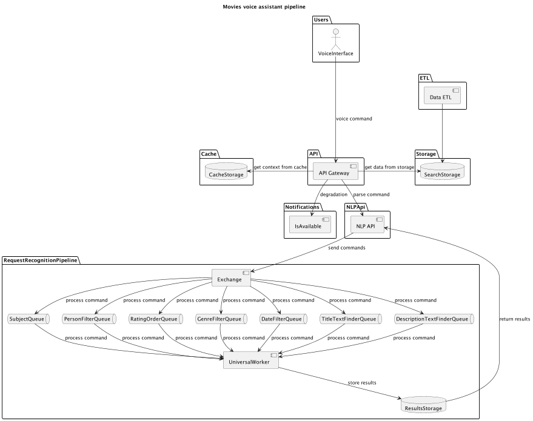

# Проектная работа: голосовой ассистент

## Описаение проекта

Решение позволяет преобразовать запрос на естественном языке от пользователя в синтаксис для работы с ElasticSearch.

Для обработки естественного языка мы решили отойти от классической схемы векторизации или словарей и использовать LLM.

Так как LLM  слишком долго отвечает на запрос пользователя, а окно ожижания доступной по ТЗ 2 секунды, то мы решили ускорить решение с помощью микрозапросов для YandexGPT. Вместо одного большого запроса мы передаём множество маленьких.




## Порядок развёртования проекта

1. Разместите пустой файл `logs.log` в директории 'logs'.
2. Скопируйте содержимое файла `.env.example` в файл `.env`.
3. Заполните сертификаты в папке `.certs` ( https://disk.yandex.ru/d/xy-vpk18OrDatw )
4. Сгенерируйте dpem ключи в папке `.certs` командой:
```bash
openssl dhparam -out ssl-dhparams.pem 2048
```

6. Чтобы добавить пользователя для кибана используем команду:
```bash
htpasswd -c ./nginx/passwords/passwords user1
```
чтобы добавить больше пользователей используем команду без `-c`:
```bash
htpasswd ./nginx/passwords/passwords user2
```

5. Настройте отображение логов в Kibana:

http://localhost:5601/app/management/kibana/dataViews

или

http://practix-cinema.ru:5601/app/management/kibana/dataViews


## Проект в интернете

https://practix-cinema.ru/api/openapi
